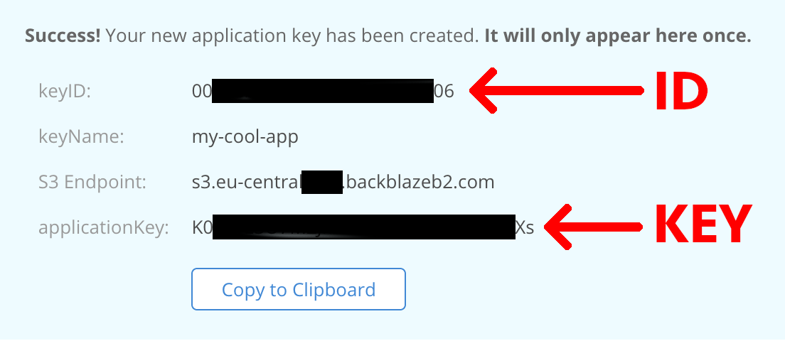

# Backblaze [](https://github.com/franciscop/backblaze/actions)

An _unofficial_ package to easily deal with Backblaze B2 API on Node.js:

```js
import Bucket from "backblaze";

const bucket = Bucket("bucket-name", {
  id: process.env.B2_ID,
  key: process.env.B2_KEY
});

console.log(await bucket.list());
// [{ name: 'favicon.png', ...}, { name: 'hello.png', ...}, ...]

// Upload a file from a local file to an auto-generated name
const file = await bucket.upload("./avatar.png");

// Let's download it now as a copy locally
await bucket.download(file, "./avatar-copy.png");
```

> Please note that file paths are relative to the **working directory** [as specified on Node.js' fs](https://nodejs.org/api/fs.html#fs_file_paths). You can always provide absolute paths.

You can work with multiple buckets as well by creating them as expected:

```js
const bucket1 = Bucket('bucket-name-1', { ... });
const bucket2 = Bucket('bucket-name-2', { ... });
```

## API

All of the methods are async so they should be used with `await`:

- [`File`](#file): a description for the remote file use in the API.
- [`Bucket(name, { id, key })`](#bucket): initialize the API with the credentials.
- [`bucket.info()`](#info): load some information related to the bucket itself.
- [`bucket.list([prefix])`](#list): show a list with all of the files in your bucket.
- [`bucket.count()`](#count): display the number of items inside a bucket.
- [`bucket.upload(local, remote)`](#upload): upload a local file to the bucket.
- [`bucket.download(remote, local)`](#download): downloads a file from the bucket into the server.
- [`bucket.read(remote)`](#read): read a file straight away.
- [`bucket.exists(remote)`](#exists): check whether a file exists on the bucket.
- [`bucket.remove(remote)`](#remove): delete a file from the bucket.

### File

A `File` is a plain object with these properties:

- `name`: the filename, same as the one listed with `bucket.list()`.
- `type`: the MIME type of the file, e.g. `image/png`.
- `size`: the weight of the file in Bytes.
- `url`: the URL for the file, specially useful if the bucket is public so that you can save this url straight away. It has the shape of `https://fNNN.backblazeb2.com/file/BUCKET/FILE`, where `NNN` depends on your account, `BUCKET` is the bucket name and `FILE` is the file name.
- `timestamp`: the uploaded timestamp as an instance of a native Date() object.

This is useful to define since it appears in different parts of the API, like in the `.list()` and `.upload()` APIs:

```js
const file = await bucket.upload(...);
console.log(file);
// {
//   name: 'kwergvckwsdb.png',
//   type: 'image/png',
//   size: 11554,
//   url: 'https://fNNN.backblazeb2.com/file/BUCKET/kwergvckwsdb.png'
//   timestamp: new Date(...)
// }
```

> Note that it is not a class or an instance of anything, just a shared plain object structure.

### Bucket()

Create an instance that can communicate with the specified bucket:

```js
import Bucket from "backblaze";
const bucket = Bucket("bucket-name", { id, key });
// await bucket.upload();
// await bucket.download();
// ...
```

> You should not use the `new` nor `await` keywords when creating a bucket.

It receives first the bucket name, and then an object with the config which preferably should come from the environment variables:

```js
const bucket = Bucket("bucket-demo", {
  id: process.env.B2_ID,
  key: process.env.B2_KEY
});
```

The `id` and `key` fields correspond to these fields when creating a new key:



The `id` and `key`, and the second parameter altogether, can be skipped if the environment variables `B2_ID` and `B2_KEY` have been set respectively:

```js
const bucket = Bucket("bucket-demo");
```

#### How Bucket() works internally

It will start loading the bucket as soon as initialized like this, and if it hasn't loaded by the time it's used then it will await on the first operation for it. That is why you don't need the `await` or `new` keywords.

If you _really_ want to wait for it finish auth and other loading before using it, you can force it like this:

```js
const bucket = Bucket("bucket-demo", {
  id: process.env.B2_ID,
  key: process.env.B2_KEY
});
await bucket.info();
```

### .info()

Load some information related to the bucket itself:

```js
const info = await bucket.info();
console.log(info);
// {
//   accountId: '...',
//   bucketId: '...',
//   bucketInfo: {},
//   bucketName: '...',
//   bucketType: '...',
//   corsRules: [],
//   lifecycleRules: [],
//   options: [ 's3' ],
//   revision: 2,
//   baseURL: 'https://fNNN.backblazeb2.com/file/BUCKET/'
// }
```

### .list()

Show a list with all of the files in your bucket. Each one is [a File object](#file) with few properties related to the file. It includes files in subfolders:

```js
const list = await bucket.list();
const list = await bucket.list("profile/"); // With a filter
console.log(list);
// [
//   {
//     name: 'kwergvckwsdb.png',
//     type: 'image/png',
//     size: 11554,
//     url: 'https://fNNN.backblazeb2.com/file/BUCKET/kwergvckwsdb.png'
//     timestamp: new Date(...)
//   },
//   ...
// ]
```

You can pass an optional prefix filter, and only those files starting by it will be returned. Use `abc/` to return only the files in folder `abc`.

You might just want to read only e.g. the filenames, so you can `.map()` it with plain Javascript:

```js
const list = await bucket.list();
console.log(list.map(file => file.name));
// ['avatar.png', 'kwergvckwsdb.png', ...]
```

### .count()

Display the number of items inside a bucket, including sub-folder files:

```js
await bucket.count();
// 27
```

### .upload()

Upload a local file to the bucket:

```js
bucket.upload(localFilePath, [remoteFileName]) => File
```

The arguments are:

- `localFilePath` (required): the path to the file to be uploaded. It will be relative to the **working directory** [as specified on Node.js' fs](https://nodejs.org/api/fs.html#fs_file_paths). TODO: accept a byte sequence.
- `remoteFileName` (optional): the name of the file in the bucket. Leave it empty to autogenerate the name. We are purposefully avoiding reusing the `localFilePath` name to avoid collisions and other issues.

It returns [a File object](#file) with the properties `name`, `type`, `size`, `url` and `timestamp` as usual:

```js
// Just upload a file and get the path in the response:
const file = await bucket.upload("./avatar.png");
console.log(file);
// {
//   name: 'kwergvckwsdb.png',
//   type: 'image/png',
//   size: 11554,
//   url: 'https://fNNN.backblazeb2.com/file/BUCKET/kwergvckwsdb.png'
//   timestamp: new Date(...)
// }

// Upload a file inside a folder and specify the remote name:
await bucket.upload("./public/favicon.png", "favicon.png");

// Upload a file to a folder in the bucket:
await bucket.upload("./avatar.png", "public/favicon.png");

// Absolute paths:
await bucket.upload(__dirname + "/avatar.png", "favicon.png");
```

If you are using a modern Node.js version that doesn't define `__dirname`, you can create `__dirname` like this:

```jsx
import { dirname } from "path";
import { fileURLToPath } from "url";

const __dirname = dirname(fileURLToPath(import.meta.url));
```

### .download()

Downloads a file from the bucket into the server:

```js
bucket.download(remoteFileName, [localFilePath]) => localFilePath
```

The arguments are:

- `remoteFileName` (required): the name of the file in the bucket. It can be inside a folder as well. You can pass either a plain string with the name, or [a full File](#file) reference.
- `localFilePath` (optional): the path where the file will be located. It will be relative to the **working directory** [as specified on Node.js' fs](https://nodejs.org/api/fs.html#fs_file_paths). Leave it empty to use the current working directory and the remote file name.

```js
// Upload the file with the same name as locally:
const path = await bucket.download("avatar.png");
console.log(path); //  /users/me/projects/backblaze/avatar.png

// Upload a file inside a folder to the root:
await bucket.download("favicon.png", "./public/favicon.png");

// Upload a file to a folder in the bucket:
await bucket.download("public/favicon.png", "./avatar.png");

// Absolute paths:
await bucket.download("favicon.png", __dirname + "/avatar.png");
```

If you are using a modern Node.js version that doesn't define `__dirname`, you can create `__dirname` like this:

```jsx
import { dirname } from "path";
import { fileURLToPath } from "url";

const __dirname = dirname(fileURLToPath(import.meta.url));
```

### .read()

Gets the content of the given file into a variable:

```js
bucket.read(remoteFileName) => file data
```

The arguments are:

- `remoteFileName` (required): the name of the file in the bucket. It can be inside a folder as well. You can pass either a plain string with the name, or [a full File](#file) reference.

```js
const raw = await bucket.read("mydata.json");
const data = JSON.parse(raw);
```

### .exists()

Check whether a file exists on the bucket:

```js
bucket.exists(remoteFileName) => Boolean
```

It accepts either a string name or [a full File reference](#file):

```js
if (await bucket.exists("avatar.png")) {
  console.log("Avatar already exists");
}

// Check inside a subfolder
if (await bucket.exists("users/abc.png")) {
  console.log("User already has a profile picture");
}
```

### .remove()

Delete a file from the bucket:

```js
bucket.remove(remoteFileName) => File
```

It accepts either a string name or [a full File reference](#file):

```js
const file = await bucket.remove("avatar.png");
console.log(file);
// {
//   name: 'kwergvckwsdb.png',
//   type: 'image/png',
//   size: 11554,
//   url: 'https://fNNN.backblazeb2.com/file/BUCKET/kwergvckwsdb.png'
//   timestamp: new Date(...)
// }

// Remove from inside a subfolder
await bucket.remove("users/abc.png");
```

It returns the description of the file that was removed.
